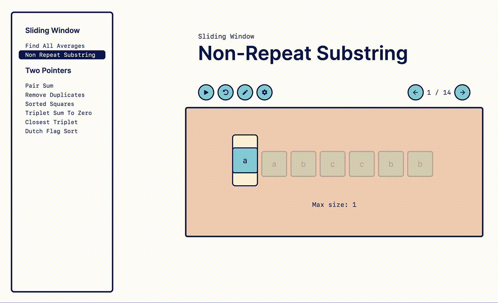

# Visualizer

  

A visualizer for common algorithm patterns made with Next.js, Tailwind, and Framer Motion, based off the patterns described in the [Grokking the Coding Interview](https://www.educative.io/courses/grokking-the-coding-interview) course on Educative. The visualizer comes packed with editable inputs, steppable animations and configurable animations. [Check it out now!](https://visualizer-sepia.vercel.app/patterns/sliding-window/find-all-averages)

> DISCLAIMER: This project is very much still a WIP so the design is not polished, not optimized for mobile, features are missing, etc. Check back regularly for updates!

## Issues

To resolve the Error: error:0308010C:digital envelope routines::unsupported error, you can set the NODE_OPTIONS environment variable to allow the use of the unsupported algorithms. This is a workaround for projects that may not yet be fully compatible with the stricter OpenSSL policies enforced by Node.js versions 17 and later.

`NODE_OPTIONS=--openssl-legacy-provider npm run dev`